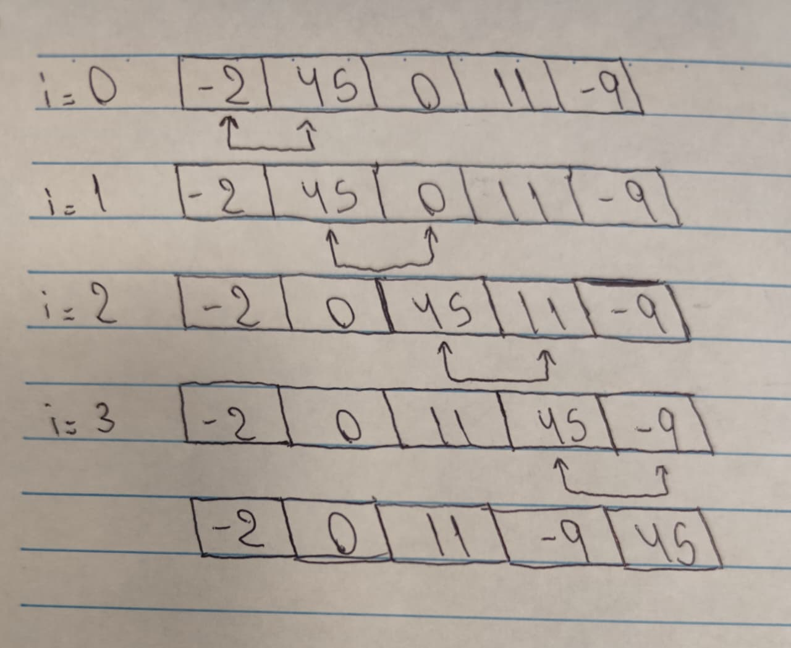
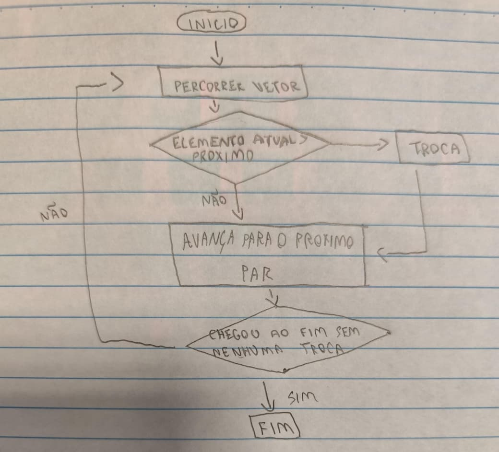

1- Tente lembrar de modelos que você já tenha visto, usado e ou
experimentado. Indique ao menos três mais relevantes.  
2- Comente brevemente seu propósito e utilidade.  
3- Descreva: suas características específicas e comuns com os demais.

1. Resposta: Fluxograma, Mapa de Karnaugh e Planta baixa de casa.

2. Resposta:
Fluxograma: Mostra de forma visual a lógica ou sequência de um algoritmo.  
Mapa de Karnaugh: Mapa utilizado para simplificar logicas booleanas.  
Planta baixa de casa: mostrar como vai ser estruturado os comodos de uma casa.  

3. Resposta:
Fluxograma: usa simbolos padronizados como retangulos(ação), losango(decisão) e setas(fluxo).  
Mapa de Karnaugh: é uma grade que abstrai algebra booleana em algo visual e manipulavel.  
Planta baixa de casa: vista de cima em escala, utiliza simbolos convencionados e foca em espaço estrutural  

-------

1- Com base nos exemplos vistos, tente lembrar de outros modelos
semelhantes que te marcaram, citando três exemplos.  
2- Novamente, comente brevemente seu propósito e utilidade.  
3- Indique como tais modelos ajudaram a compreender com maior
clareza os sistemas, processos ou conceitos envolvidos, destacando
as vantagens e desvantagens dessas representações.  

1. Diagrama de funcionamento da ULA, modelo do sistema solar e organograma de uma empresa.

2. Resposta:
Diagrama de funcionamento da ULA: mostrar como dados entram, passam pelas operações logicas e saem como resultado.  
Modelo do sistema solar: mostrar a posição dos planetas em relação ao sol.  
Organograma de uma empresa: mostrar as relações entre cargos.

3. Resposta:
Diagrama de funcionamento da ULA:  
Vantagem: simplifica um circuito complexo em blocos de facil entendimento.    
Desvantagem: esconde a implementação real em nivel de portas logicas.  
Modelo do sistema solar:  
Vantagem: é visual e intuitivo, ajudando a fixar as posições e ordem dos planetas.  
Desvantagem: geralmente não respeita a escala real.  
Organograma de uma empresa:  
Vantagem: simples, visual, facil de atualizar.  
Desvantagem: não mostra fluxo de comunicação real nem processo do dia a dia.

-------

1- Considerando um segundo algoritmo de ordenação (ex. Quick
Sort), revise o algoritmo e tente explicá-lo usando diferentes
perspectivas e representações:
1. Linguagem natural  
2. Diagramas livres  
3. Pseudo-código ou código  
4. Diagrama formal (UML, DFD, ...)  

2- Compare as explicações dadas em cada perspectiva quanto a
clareza e facilidade de entendimento, tipo de público alvo, curva de
aprendizado necessária para criar e compreender, recursos
disponíveis para representação e contexto de aplicação (quando
seria utilizada?).  

1. Resposta:
Linguagem natural: Percorrer o vetor várias vezes comparando cada par de elementos vizinhos. Caso o da esquerda for maior que o da direita, troque os dois de lugar. Ficar repetindo isso, a cada passagem o elemento maior é levado como uma bolha para o final.  
Diagrama Livre:   
Pseudo-Código:  
para i de 0 até n-1:  
    trocou = falso  
    para j de 0 até n-i-2:  
        se vetor[j] > vetor[j+1]:  
            troca(vetor[j], vetor[j+1])  
            trocou = verdadeiro  
    se trocou == falso:  
        pare  // já está ordenado  
Diagrama Formal:   

2. Resposta: 
 
Linguagem natural  

Clareza: fácil de entender, mas pode ser vaga  
Público: qualquer pessoa, mesmo sem conhecimento técnico  
Aprendizado: nenhum necessário  
Recursos: só precisa de texto  
Quando usar: explicar o algoritmo pra alguém leigo  

Diagrama livre  

Clareza: visual e intuitivo, mas pouco preciso  
Público: iniciantes, uso em brainstorm  
Aprendizado: baixo, só criatividade  
Recursos: papel e caneta  
Quando usar: organizar a ideia antes de codificar  

Pseudocódigo  

Clareza: boa pra quem já tem lógica de programação, difícil pra leigos  
Público: estudantes e programadores  
Aprendizado: médio, precisa entender lógica/estrutura  
Recursos: só editor de texto  
Quando usar: planejar a lógica antes de escrever o código real  

Diagrama formal (fluxograma)  

Clareza: estruturada e precisa, mas pode poluir se o algoritmo crescer  
Público: desenvolvedores, documentação técnica  
Aprendizado: mais alto, exige conhecer a notação  
Recursos: ferramenta de diagramação  
Quando usar: documentar formalmente ou comunicar entre equipes  

-------

1-Selecione ao menos três modelos entre os exemplos vistos
anteriormente e comente sobre como se adequam aos propósitos
da modelagem, considerando as finalidades de Entendimento,
Comunicação, Análise, Projeto e Documentação.  
2-Sugira representações alternativas que poderiam melhorar ou
complementar alguma falha ou fraqueza dessas representações.  

1.  
2.  